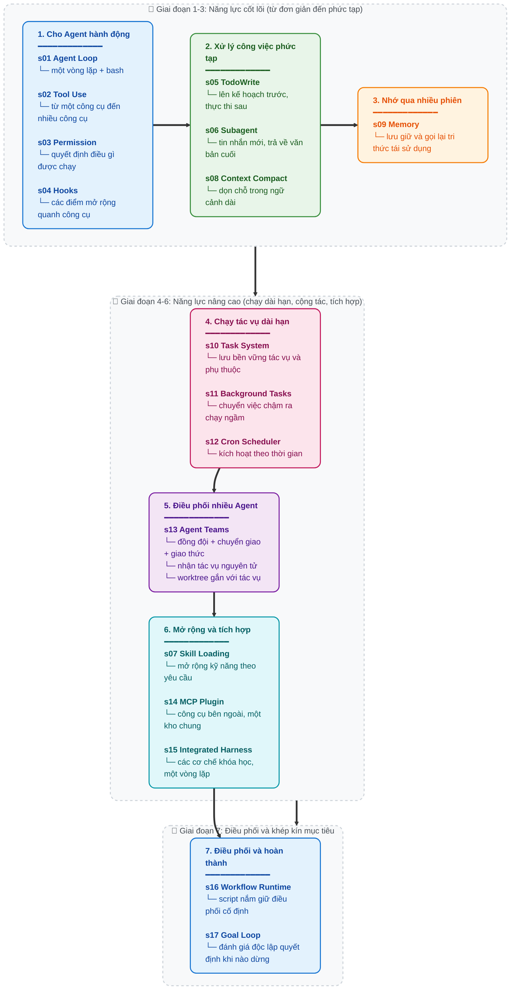

[English](README.md) | [中文](README-zh.md) | [日本語](README-ja.md) | [Tiếng Việt](README-vi.md)

<a href="https://trendshift.io/repositories/19746" target="_blank"></a>

# Learn Claude Code -- Kỹ Thuật Xây Dựng Harness Cho Agent Thực Thụ

## Agency Đến Từ Mô Hình. Một Sản Phẩm Agent = Mô Hình + Harness.

Trước khi viết bất kỳ dòng mã nào, có một điều cần phải làm rõ.

**Agency (Tính chủ động / Khả năng tự chủ) -- năng lực nhận thức, suy luận và hành động -- đến từ quá trình huấn luyện mô hình, chứ không đến từ việc điều phối bằng mã code bên ngoài.** Nhưng một sản phẩm agent hoạt động được trong thực tế bắt buộc phải có cả hai: mô hình và harness. Mô hình là người lái. Harness là cỗ xe. Kho lưu trữ này hướng dẫn bạn cách chế tạo cỗ xe đó.

### Nguồn Gốc Của Agency

Ở trung tâm của mọi agent là một mạng nơ-ron (neural network) -- một Transformer, một RNN, một hàm số được huấn luyện -- định hình qua hàng tỷ lần cập nhật gradient trên các chuỗi dữ liệu nhận thức, suy luận và hành động. Agency chưa bao giờ được ban tặng bởi lớp code bao bọc bên ngoài. Nó được học trong suốt quá trình huấn luyện.

Con người chính là minh chứng nguyên bản. Một mạng nơ-ron sinh học, được tôi luyện qua hàng triệu năm áp lực tiến hóa, nhận thức thế giới qua các giác quan, suy luận qua bộ não và hành động thông qua cơ thể. Khi DeepMind, OpenAI hay Anthropic nói về "agent", họ đều cùng chỉ một bản chất cốt lõi: **một mô hình đã học cách hành động qua quá trình huấn luyện, cộng với cơ sở hạ tầng cho phép nó vận hành trong một môi trường cụ thể.**

Dấu ấn lịch sử là không thể phủ nhận:

- **2013 -- DeepMind DQN chơi Atari.** Một mạng nơ-ron duy nhất, chỉ nhận các điểm ảnh thô (raw pixels) và điểm số trò chơi, đã tự học chơi 7 trò chơi Atari 2600 -- vượt qua các thuật toán trước đó và đánh bại các chuyên gia con người ở 3 trò. Đến năm 2015, quy mô mở rộng lên [49 trò chơi ở cấp độ người kiểm thử chuyên nghiệp](https://www.nature.com/articles/nature14236), được công bố trên tạp chí *Nature*. Không hề có các quy tắc đặc thù cho từng game. Chỉ một mô hình duy nhất, tự học từ kinh nghiệm.

- **2019 -- OpenAI Five chinh phục Dota 2.** Năm mạng nơ-ron đã tự đấu với chính mình tương đương [45.000 năm chơi Dota 2](https://openai.com/index/openai-five-defeats-dota-2-world-champions/) trong vòng 10 tháng, rồi sau đó đánh bại **OG** -- đương kim vô địch thế giới TI8 -- với tỷ số 2-0 trong trận đấu trực tiếp. Ở đấu trường công cộng, AI này giành chiến thắng 99,4% trên tổng số 42.729 trận. Không hề có chiến thuật được lập trình sẵn. Các mô hình đã tự học tinh thần đồng đội thông qua cơ chế tự đấu (self-play).

- **2019 -- DeepMind AlphaStar làm chủ StarCraft II.** AlphaStar [đánh bại tuyển thủ chuyên nghiệp với tỷ số 10-1](https://deepmind.google/blog/alphastar-mastering-the-real-time-strategy-game-starcraft-ii/) trong các trận đấu kín, sau đó đạt [thứ hạng Grandmaster](https://www.nature.com/articles/d41586-019-03298-6) trên máy chủ châu Âu -- top 0,15% trong số 90.000 người chơi. Một tựa game thời gian thực với thông tin bất toàn cùng không gian hành động tổ hợp vượt xa cờ vua hay cờ vây.

- **2019 -- Tencent Jueyu (Tuyệt Nghệ) thống trị Vương Giả Vinh Diệu (Honor of Kings).** Hệ thống "Jueyu" của Tencent AI Lab [đã đánh bại các tuyển thủ chuyên nghiệp KPL trong trận 5v5 hoàn chỉnh](https://www.jiemian.com/article/3371171.html) tại vòng bán kết World Champion Cup. Ở chế độ 1v1, các tuyển thủ chuyên nghiệp [chỉ thắng được 1 trong 15 trận, và trận đấu lâu nhất cũng chưa đầy 8 phút](https://developer.aliyun.com/article/851058). Cường độ huấn luyện: một ngày tương đương 440 năm trải nghiệm của con người. Một mô hình đã tự học toàn bộ trò chơi từ con số không thông qua self-play.

- **2024-2025 -- Các agent LLM định hình lại ngành kỹ nghệ phần mềm.** Claude, GPT, Gemini -- các mô hình ngôn ngữ lớn được huấn luyện trên toàn bộ kho tàng mã nguồn và khả năng suy luận của nhân loại -- được triển khai dưới dạng coding agent. Chúng đọc hiểu codebase, viết mã triển khai, gỡ lỗi khi thất bại và phối hợp làm việc theo nhóm. Kiến trúc này hoàn toàn tương đồng với mọi agent tiền nhiệm: một mô hình được huấn luyện, đặt trong một môi trường nhất định, được trang bị các công cụ để nhận thức và hành động.

Mọi cột mốc đều hướng về cùng một sự thật: **Agency -- khả năng nhận thức, suy luận và hành động -- được huấn luyện ra, chứ không thể lập trình ra.** Nhưng mọi agent cũng đều cần một môi trường để vận hành: một trình giả lập Atari, client game Dota 2, engine StarCraft II, một IDE và một terminal. Mô hình cung cấp trí tuệ. Môi trường cung cấp không gian hành động. Kết hợp lại, chúng tạo thành một agent hoàn chỉnh.

### Thế Nào KHÔNG Phải Là Một Agent

Từ "agent" đang bị lạm dụng bởi toàn bộ một ngành công nghiệp nối ghép lời nhắc (prompt-plumbing).

Những công cụ kéo thả quy trình (workflow builders). Các nền tảng no-code gắn mác "AI Agent". Những thư viện điều phối chuỗi prompt (prompt-chain orchestration). Tất cả đều chia sẻ chung một ảo tưởng: rằng việc kết nối các lệnh gọi API của LLM lại với nhau bằng các nhánh if-else, sơ đồ node và logic định tuyến mã hóa cứng đồng nghĩa với việc "xây dựng một agent".

Hoàn toàn không phải. Những gì họ tạo ra chỉ là những cỗ máy Rube Goldberg -- những đường ống quy tắc thủ tục cồng kềnh, mỏng manh, máy móc với một LLM bị nhồi nhét vào chỉ đóng vai trò như một node hoàn thiện văn bản được ca tụng quá đà. Đó không phải là một agent. Đó là một shell script với tham vọng viển vông.

Bạn không thể dùng sức trâu để tạo ra trí tuệ bằng cách xếp chồng các logic thủ tục -- những cây quy tắc rối rắm, sơ đồ node, chuỗi thác đổ prompt -- rồi cầu nguyện rằng từng đó đoạn code chắp vá sẽ tự phát sinh hành vi tự chủ. Điều đó sẽ không xảy ra. Bạn không thể lập trình mà ép sinh ra agency được. Agency được học, chứ không phải được code ra.

### Chuyển Đổi Tư Duy: Từ "Xây Dựng Agent" Sang Xây Dựng Harness

Khi ai đó nói "Tôi đang xây dựng một agent", họ chỉ có thể có ý chỉ một trong hai điều:

**1. Huấn luyện một mô hình.** Tinh chỉnh trọng số thông qua học tăng cường (reinforcement learning), fine-tuning, RLHF hoặc một phương pháp dựa trên gradient khác. Thu thập dữ liệu quỹ đạo (trajectory data) -- các chuỗi nhận thức, suy luận và hành động thực tế trong một lĩnh vực mục tiêu -- và sử dụng dữ liệu đó để định hình hành vi của mô hình. Đây là công việc của DeepMind, OpenAI, Tencent AI Lab và Anthropic.

**2. Xây dựng một harness.** Viết mã cung cấp cho mô hình một môi trường hoạt động. Đây là việc mà đa số chúng ta làm, và cũng là trọng tâm cốt lõi của kho lưu trữ này.

Một harness là tất cả những gì một agent cần để làm việc trong một lĩnh vực cụ thể:

```
Harness = Công cụ + Tri thức + Quan sát + Giao diện Hành động + Quyền hạn

    Công cụ (Tools):                 I/O tệp, shell, mạng, cơ sở dữ liệu, trình duyệt
    Tri thức (Knowledge):            tài liệu sản phẩm, tài liệu miền, đặc tả API, hướng dẫn phong cách
    Quan sát (Observation):          git diff, nhật ký lỗi, trạng thái trình duyệt, dữ liệu cảm biến
    Hành động (Action):              lệnh CLI, lệnh gọi API, tương tác giao diện UI
    Quyền hạn (Permissions):         cách ly sandbox, quy trình phê duyệt, ranh giới tin cậy
```

Mô hình quyết định. Harness thực thi. Mô hình suy luận. Harness cung cấp ngữ cảnh. Mô hình là người lái. Harness là cỗ xe.

Kho lưu trữ này hướng dẫn bạn chế tạo cỗ xe đó. Một cỗ xe phục vụ lập trình. Nhưng các mẫu thiết kế này có thể tổng quát hóa cho bất kỳ lĩnh vực nào.

### Các Kỹ Sư Harness Thực Sự Làm Gì

Nếu bạn đang đọc tài liệu này, rất có thể bạn là một kỹ sư harness. Dưới đây là những công việc thực tế mà vai trò này đảm nhận:

- **Hiện thực hóa công cụ (Implement tools).** Trao đôi tay cho agent. Đọc/ghi tệp, thực thi shell, gọi API, điều khiển trình duyệt, truy vấn cơ sở dữ liệu. Mỗi công cụ là một hành động mà agent có thể thực hiện trong môi trường của nó. Hãy thiết kế chúng có tính nguyên tử, có thể kết hợp và được mô tả rõ ràng.

- **Tuyển chọn tri thức (Curate knowledge).** Trao cho agent chuyên môn theo lĩnh vực. Tài liệu sản phẩm, hồ sơ quyết định kiến trúc (ADR), hướng dẫn phong cách mã nguồn, các yêu cầu tuân thủ. Nạp theo yêu cầu (on-demand), không nạp trước ồ ạt.

- **Quản lý ngữ cảnh (Manage context).** Subagent giữ cho công việc tập trung trong một danh sách tin nhắn riêng biệt. Thu gọn ngữ cảnh (context compaction) cắt ngắn bớt lịch sử cũ. Hệ thống tác vụ (task system) giúp các mục tiêu tồn tại vượt ra ngoài phạm vi của một phiên trò chuyện đơn lẻ.

- **Kiểm soát quyền hạn (Control permissions).** Đặt ra ranh giới cho agent. Đưa việc truy cập tệp vào sandbox. Yêu cầu phê duyệt đối với các thao tác mang tính phá hủy. Thực thi ranh giới tin cậy giữa agent và các hệ thống bên ngoài.

- **Thu thập dữ liệu quỹ đạo (Collect trajectory data).** Mỗi chuỗi hành động mà agent thực thi trong harness của bạn đều là tín hiệu huấn luyện quý giá. Các quỹ đạo triển khai thực tế chính là nguyên liệu thô để tinh chỉnh thế hệ mô hình agent tiếp theo.

Bạn không lập trình ra trí tuệ. Bạn xây dựng thế giới mà trí tuệ đó sinh sống. Chất lượng của thế giới đó quyết định trực tiếp mức độ hiệu quả mà trí tuệ có thể bộc lộ ra.

**Hãy xây dựng harness thật tốt. Mô hình sẽ lo phần còn lại.**

### Tại Sao Lại Là Claude Code

Bởi vì Claude Code là bản hiện thực hóa agent harness thanh lịch và hoàn chỉnh nhất mà chúng tôi từng thấy. Không phải nhờ vào bất kỳ mẹo vặt khéo léo nào, mà chính vì những gì nó *không làm*: nó không cố gắng tự biến mình thành agent. Nó không áp đặt các quy trình cứng nhắc. Nó không thay thế khả năng phán đoán của mô hình bằng những cây quyết định được tạo thủ công. Nó cung cấp cho mô hình các công cụ, tri thức, khả năng quản lý ngữ cảnh và ranh giới phân quyền -- rồi sau đó lùi lại phía sau để mô hình tự hành động.

Nếu lược bỏ Claude Code về bản chất cốt lõi:

```
Claude Code = một vòng lặp agent (agent loop)
            + các công cụ (bash, read, write, edit, glob, grep, browser...)
            + nạp kỹ năng theo yêu cầu (skill loading)
            + thu gọn ngữ cảnh (context compaction)
            + khởi tạo subagent (subagent spawning)
            + hệ thống tác vụ với đồ thị phụ thuộc (task system)
            + phối hợp nhóm qua hòm thư bất đồng bộ (async mailbox)
            + worktree gắn với tác vụ cho các chỉnh sửa song song
            + quản trị quyền hạn (permissions)
            + hệ thống mở rộng điểm can thiệp vòng đời (hooks)
            + bộ nhớ lưu trữ bền vững (memory)
            + định tuyến năng lực bên ngoài qua MCP
```

Chỉ đơn giản có vậy. Còn bản thân agent? Đó là Claude. Một mô hình. Được Anthropic huấn luyện trên toàn bộ kho tàng suy luận và mã nguồn của nhân loại. Harness không làm cho Claude trở nên thông minh hơn. Claude vốn dĩ đã thông minh. Harness chỉ trao cho Claude đôi tay, đôi mắt và một không gian làm việc.

Bài học rút ra không phải là "sao chép Claude Code". Bài học ở đây là: **những sản phẩm agent xuất sắc nhất đến từ những kỹ sư hiểu rằng công việc của họ là xây dựng harness, chứ không phải là lập trình trí tuệ.**

---

```
                    MẪU HÌNH AGENT (THE AGENT PATTERN)
                    ==================================

    Người dùng --> messages[] --> LLM --> phản hồi
                                             |
                                   chứa khối tool_use?
                                  /                    \
                                có                     không
                                 |                       |
                           thực thi công cụ        trả về văn bản
                           thêm kết quả vào
                           quay lại vòng lặp ---------> messages[]


    Mô hình quyết định khi nào cần gọi công cụ và khi nào nên dừng lại.
    Mã nguồn chỉ đơn thuần thực thi những gì mô hình yêu cầu.
    Kho lưu trữ này hướng dẫn bạn xây dựng mọi thứ xung quanh vòng lặp này --
    harness giúp agent hoạt động hiệu quả trong một lĩnh vực cụ thể.
```

## Mẫu Hình Cốt Lõi (Core Pattern)

```python
def agent_loop(messages):
    while True:
        response = client.messages.create(
            model=MODEL, system=SYSTEM,
            messages=messages, tools=TOOLS,
        )
        messages.append({"role": "assistant",
                         "content": response.content})

        tool_calls = [
            block for block in response.content if block.type == "tool_use"
        ]
        if not tool_calls:
            return

        results = []
        for block in tool_calls:
            output = TOOL_HANDLERS[block.name](**block.input)
            results.append({
                "type": "tool_result",
                "tool_use_id": block.id,
                "content": output,
            })
        messages.append({"role": "user", "content": results})
```

Mỗi bài học cô lập một cơ chế harness xung quanh vòng lặp này. s15 kết nối lại toàn bộ runtime tích lũy; s16 và s17 sau đó nghiên cứu về điều phối quy trình (workflow orchestration) và khép kín mục tiêu (goal closure) như những ví dụ tập trung. Vòng lặp thuộc về agent. Các cơ chế thuộc về harness.

Vòng lặp là bất biến. Công cụ, tri thức và quyền hạn thay đổi. Agent = Mô hình (LLM) + một môi trường hoạt động được tổng quát hóa (Harness).

---

## Tình Trạng Phiên Bản (Version Status)

Kho lưu trữ này hiện bao gồm hai tuyến hướng dẫn:

- **Tuyến hiện tại: cấp thư mục gốc `s01-s17`**
  Các thư mục cấp gốc `s01_*` ... `s17_*` là phiên bản chuẩn (canonical). Mỗi chương gồm một README tiếng Anh mặc định, các bản dịch tiếng Trung/tiếng Nhật/tiếng Việt, file `code.py` có thể chạy trực tiếp và các sơ đồ minh họa khi cần thiết.
- **Tuyến chuyển tiếp cũ: `docs/` và `agents/`**
  Các thư mục này lưu giữ phiên bản 12 bài học cũ cho độc giả hiện tại và các liên kết cũ trong quá trình chuyển đổi.

Nếu bạn mới bắt đầu học, hãy đọc từ chương `s01_agent_loop/` đến `s17_goal_loop/` ở thư mục gốc. Số thứ tự chương cũ và mới không phải lúc nào cũng khớp nhau, do đó tránh nhầm lẫn giữa hai tuyến này.

### Ánh Xạ Tuyến Cũ Sang Tuyến Hiện Tại

| Tuyến 12 bài cũ | Tuyến 17 bài hiện tại | Chủ đề |
|---|---|---|
| s01 cũ | s01 mới | Vòng lặp Agent (Agent Loop) |
| s02 cũ | s02 mới | Sử dụng công cụ (Tool Use) |
| s03 cũ | s05 mới | TodoWrite |
| s04 cũ | s06 mới | Subagent |
| s05 cũ | s07 mới | Nạp kỹ năng (Skill Loading) |
| s06 cũ | s08 mới | Thu gọn ngữ cảnh (Context Compact) |
| s07 cũ | s10 mới | Hệ thống tác vụ (Task System) |
| s08 cũ | s11 mới | Tác vụ chạy ngầm (Background Tasks) |
| s09 cũ | s13 mới | Đội ngũ Agent (Agent Teams) |
| s10 cũ | s13 mới | Giao thức phối hợp nhóm (Team Protocols) |
| s11 cũ | s13 mới | Nhận tác vụ tự chủ (Autonomous task claiming) |
| s12 cũ | s13 mới | Worktree gắn với tác vụ (Task-bound worktrees) |
| Chỉ có ở bản mới | s03, s04, s09, s12, s14, s15, s16, s17 | Quyền hạn (Permission), Hooks, Bộ nhớ (Memory), Cron, MCP, Khung điều hành tích hợp (Integrated Harness), Môi trường thực thi quy trình (Workflow Runtime), Chu trình hướng mục tiêu (Goal Loop) |

---

## Phạm Vi Khóa Học (Course Boundary)

Đây là khóa học kỹ thuật harness từ 0 đến 1. Mỗi chương cô lập một cơ chế, sau đó s15 kết nối lại toàn bộ runtime tích lũy trong một vòng lặp agent hoàn chỉnh. s16 mở rộng vòng lặp đó bằng việc điều phối quy trình (workflow). s17 sử dụng một tập công cụ tinh gọn hơn để tập trung vào việc tiếp tục chạy có kiểm soát mục tiêu; đó là một ví dụ minh họa cơ chế, chứ không phải một runtime tích lũy khác.

---

## 17 Bài Học Tịnh Tiến (17 Progressive Lessons)

**Mỗi bài học bổ sung một cơ chế harness. Mỗi cơ chế đều mang một phương châm hành động.**

> **s01** &nbsp; *"Một vòng lặp & Bash là tất cả những gì bạn cần"* &mdash; một công cụ + một vòng lặp = một agent
>
> **s02** &nbsp; *"Thêm một công cụ chỉ đơn giản là thêm một handler"* &mdash; vòng lặp giữ nguyên không đổi; công cụ mới được đăng ký vào bảng điều phối (dispatch map)
>
> **s03** &nbsp; *"Thiết lập ranh giới trước, trao quyền tự do sau"* &mdash; kiểm tra lệnh nào được phép chạy, lệnh nào phải chặn và lệnh nào cần phê duyệt
>
> **s04** &nbsp; *"Gắn hook quanh vòng lặp, đừng bao giờ viết lại vòng lặp"* &mdash; bổ sung các điểm mở rộng mà không cần sửa đổi vòng lặp chính
>
> **s05** &nbsp; *"Một agent không có kế hoạch sẽ mất phương hướng"* &mdash; liệt kê các bước trước khi bắt đầu; tỷ lệ hoàn thành công việc tăng gấp đôi
>
> **s06** &nbsp; Trao cho tác vụ con một danh sách `messages[]` hoàn toàn mới; văn bản kết quả cuối cùng trả về như một kết quả công cụ đơn lẻ
>
> **s07** &nbsp; *"Nạp tri thức theo yêu cầu, không nạp trước ồ ạt"* &mdash; liệt kê danh mục kỹ năng trước, chỉ mở rộng chi tiết khi thực sự cần dùng
>
> **s08** &nbsp; *"Ngữ cảnh luôn sẽ đầy -- phải có cách giải phóng không gian"* &mdash; bốn bước thu gọn: giảm bớt kết quả công cụ trước, sau đó tóm tắt lịch sử nếu vẫn vượt ngưỡng giới hạn
>
> **s09** &nbsp; *"Nhớ điều quan trọng, quên điều vụn vặt"* &mdash; ba hệ thống con: chọn lọc (selection), trích xuất (extraction), củng cố (consolidation)
>
> **s10** &nbsp; *"Mục tiêu lớn chia thành tác vụ nhỏ, sắp xếp thứ tự, lưu xuống đĩa"* &mdash; đồ thị tác vụ lưu trên tệp đặt nền móng cho sự phối hợp giữa nhiều agent
>
> **s11** &nbsp; *"Thao tác chậm chuyển ra chạy ngầm, agent tiếp tục suy nghĩ"* &mdash; các luồng nền thực thi lệnh; thông báo được đẩy vào khi hoàn tất
>
> **s12** &nbsp; *"Kích hoạt theo lịch, không cần con người thúc giục"* &mdash; tự động kích hoạt các tác vụ dựa trên thời gian
>
> **s13** &nbsp; *"Quá lớn cho một agent -- hãy để đồng đội chia sẻ công việc"* &mdash; các đồng đội tồn tại bền bỉ phối hợp cùng nhau, nhận tác vụ sẵn sàng và sử dụng thư mục làm việc gắn với tác vụ
>
> **s14** &nbsp; *"Không đủ năng lực? Cắm thêm qua MCP"* &mdash; kết nối các công cụ bên ngoài vào cùng một kho công cụ chung
>
> **s15** &nbsp; *"Nhiều cơ chế, một vòng lặp"* &mdash; các cơ chế được sử dụng trong ví dụ tích hợp cùng chia sẻ chung một harness duy nhất
>
> **s16** &nbsp; *"Khi cấu trúc điều phối đã cố định, hãy mã hóa nó thành code"* &mdash; các quy trình công việc đã lưu kèm nhật ký có thể phục hồi tiếp tục
>
> **s17** &nbsp; *"Mục tiêu quyết định khi nào vòng lặp được phép dừng"* &mdash; một bộ đánh giá độc lập xem xét từng đề xuất dừng; các mục tiêu bất khả thi, thất bại hoặc quá giới hạn sẽ trả quyền điều khiển về cho người dùng

---

## Lộ Trình Học Tập (Learning Path)

Mạch phát triển chính: hành động → xử lý công việc phức tạp → ghi nhớ qua các phiên → chạy các tác vụ dài hạn → cộng tác nhóm → mở rộng và tích hợp → điều phối và khép kín mục tiêu.



---

## Toàn Bộ Các Chương (All Chapters)

| Chương | Chủ đề | Khái niệm then chốt |
|---|---|---|
| [s01](./s01_agent_loop/) | Vòng lặp Agent (Agent Loop) | `messages` / `while True` / `tool_use` |
| [s02](./s02_tool_use/) | Sử dụng công cụ (Tool Use) | `TOOL_HANDLERS` / bảng điều phối (dispatch map) / đồng thời (concurrency) |
| [s03](./s03_permission/) | Hệ thống phân quyền (Permission System) | `PermissionRule` / đường ống phê duyệt (approval pipeline) |
| [s04](./s04_hooks/) | Hệ thống Hook (Hook System) | `PreToolUse` / `PostToolUse` / các điểm mở rộng |
| [s05](./s05_todo_write/) | TodoWrite | `TodoItem` / lên kế hoạch trước - thực thi sau |
| [s06](./s06_subagent/) | Subagent | `fresh messages[]` / cách ly ngữ cảnh (context isolation) |
| [s07](./s07_skill_loading/) | Nạp kỹ năng (Skill Loading) | `SkillLoader` / danh mục kỹ năng (catalog) / nạp bổ sung theo yêu cầu |
| [s08](./s08_context_compact/) | Thu gọn ngữ cảnh (Context Compact) | tool_result_budget / snip_compact / micro_compact / compact_history |
| [s09](./s09_memory/) | Hệ thống bộ nhớ (Memory System) | chọn lọc (selection) / trích xuất (extraction) / củng cố (consolidation) |
| [s10](./s10_task_system/) | Hệ thống tác vụ (Task System) | `TaskRecord` / `blockedBy` / lưu trữ bền vững trên đĩa |
| [s11](./s11_background_tasks/) | Tác vụ chạy ngầm (Background Tasks) | thực thi đa luồng (threaded execution) / hàng đợi thông báo |
| [s12](./s12_cron_scheduler/) | Bộ lập lịch Cron (Cron Scheduler) | lập lịch bền vững / kích hoạt theo phạm vi phiên |
| [s13](./s13_agent_teams/) | Đội ngũ Agent (Agent Teams) | đồng đội bền bỉ / nhận việc nguyên tử / worktree gắn tác vụ / giao thức định kiểu |
| [s14](./s14_mcp_plugin/) | Plugin MCP (MCP Plugin) | khám phá công cụ / không gian tên công cụ / tích hợp kho công cụ |
| [s15](./s15_integrated_harness/) | Khung điều hành tích hợp (Integrated Harness) | công cụ, ngữ cảnh runtime, tác vụ, đội nhóm, lập lịch và MCP quanh một vòng lặp |
| [s16](./s16_workflow_runtime/) | Môi trường thực thi quy trình (Workflow Runtime) | điều phối qua script / sự kiện vòng đời / tiếp tục từ nhật ký (journal resume) |
| [s17](./s17_goal_loop/) | Chu trình hướng mục tiêu (Goal Loop) | cổng mục tiêu (goal gate) / đánh giá hội thoại / tự động tiếp tục |

---

## Hướng Dẫn Đọc

Mỗi chương là một thư mục riêng biệt. Khi mở một chương ra, bạn sẽ thấy:

```
s08_context_compact/
  README.md              # Tiếng Anh, README mặc định của chương
  README.zh.md           # Bản dịch tiếng Trung
  README.ja.md           # Bản dịch tiếng Nhật
  README.vi.md           # Bản dịch tiếng Việt
  code.py                # mã nguồn triển khai hoàn chỉnh có thể chạy độc lập
  images/                # sơ đồ SVG (nếu cần)
```

Hãy đọc file `README.md` (hoặc `README.vi.md`) để nắm ý tưởng cốt lõi và nghiên cứu từng dòng code. Các chương phức tạp có thêm các khối gấp `<details>` để đào sâu chi tiết -- hãy mở ra khi bạn muốn tìm hiểu kỹ hơn. Các chương đơn giản có 0-1 sơ đồ, các chương phức tạp sẽ có nhiều sơ đồ minh họa hơn.

Hãy đọc tuần tự từ s01 đến s17. Một số cơ chế được xây dựng trực tiếp nối tiếp runtime trước đó; các chương cơ chế độc lập sẽ nêu rõ chúng sử dụng nhân kernel từ bài nào trước đó.

---

## Bắt Đầu Nhanh (Quick Start)

### Tuyến 17 Bài Học Hiện Tại

```sh
git clone https://github.com/shareAI-lab/learn-claude-code
cd learn-claude-code
pip install -r requirements.txt
cp .env.example .env   # cấu hình ANTHROPIC_API_KEY

python s01_agent_loop/code.py        # Bắt đầu tại đây -- một vòng lặp + bash
python s08_context_compact/code.py   # Thu gọn ngữ cảnh (phức tạp)
python s17_goal_loop/code.py         # Điểm kết thúc: tiếp tục cho đến khi đạt mục tiêu có thể kiểm chứng
```

### Tuyến 12 Bài Học Cũ (Legacy)

```sh
python agents/s01_agent_loop.py
python agents/s12_worktree_task_isolation.py
python agents/s_full.py
```

### Nền Tảng Web (Web Platform)

Ứng dụng web tự động trích xuất nội dung từ khóa học ở cấp thư mục gốc. Các bài học s16 và s17 bao gồm các chế độ xem bài đọc, mã nguồn, trình mô phỏng và kiến trúc; chỉ có các hình ảnh trực quan hóa hero chuyên biệt là được giữ tối giản có chủ đích.

```sh
cd web && npm install && npm run dev   # http://localhost:3000
```

---

## Cấu Trúc Dự Án (Project Structure)

```
learn-claude-code/
  s01_agent_loop/          # mỗi chương một thư mục
    README.md              #   tiếng Anh mặc định (nội dung đầy đủ)
    README.zh.md           #   bản dịch tiếng Trung
    README.ja.md           #   bản dịch tiếng Nhật
    README.vi.md           #   bản dịch tiếng Việt
    code.py                #   mã nguồn độc lập có thể chạy trực tiếp
    images/                #   sơ đồ SVG
  s02_tool_use/
  ...
  s14_mcp_plugin/
  s15_integrated_harness/
  s16_workflow_runtime/
  s17_goal_loop/           # chương đích cuối cùng
  agents/                  # 12 bản script chạy cũ + s_full.py
  skills/                  # các tệp kỹ năng dùng trong s07
  docs/                    # tài liệu 12 bài học cũ, giữ lại trong giai đoạn chuyển đổi
  web/                     # được sinh tự động từ khóa học ở thư mục gốc
  tests/
```

---

## Bước Tiếp Theo Là Gì

Sau 17 bài học, bạn đã thấu hiểu kỹ thuật harness từ trong ra ngoài. Có hai con đường để biến tri thức đó thành sản phẩm thực tế:

### Kode Agent CLI -- CLI Coding Agent Mã Nguồn Mở

> `npm i -g @shareai-lab/kode`

Hỗ trợ Skill và LSP, tương thích Windows, hoạt động tốt với GLM / MiniMax / DeepSeek cùng các mô hình mã nguồn mở khác. Cài đặt và sử dụng ngay.

GitHub: **[shareAI-lab/Kode-CLI](https://github.com/shareAI-lab/Kode-CLI)**

### Kode Agent SDK -- Nhúng Năng Lực Agent Vào Ứng Dụng Của Bạn

Một thư viện độc lập không gây quá tải tiến trình cho mỗi người dùng. Nhúng trực tiếp vào backend, tiện ích mở rộng trình duyệt (extension), thiết bị nhúng hoặc bất kỳ môi trường thực thi nào.

GitHub: **[shareAI-lab/kode-agent-sdk](https://github.com/shareAI-lab/kode-agent-sdk)**

---

## Hướng Dẫn Song Sinh: Từ Phiên Tương Tác Bị Động Đến Trợ Lý Luôn Thường Trực

Harness được giảng dạy trong kho lưu trữ này thuộc loại **dùng xong rồi bỏ** -- mở terminal, giao việc cho agent, đóng lại khi xong việc, phiên làm việc tiếp theo bắt đầu hoàn toàn mới. Claude Code hoạt động theo phương thức này.

Nhưng [OpenClaw](https://github.com/openclaw/openclaw) đã chứng minh một khả năng khác: trên cùng một nhân agent cốt lõi đó, chỉ cần bổ sung hai cơ chế harness là có thể biến agent từ "chạm vào mới nhúc nhích" thành "tự động thức dậy mỗi 30 giây để tìm việc làm":

- **Nhịp tim (Heartbeat)** -- cứ mỗi 30 giây, harness gửi cho agent một tin nhắn, cho phép nó kiểm tra xem có công việc nào đang chờ xử lý hay không. Không có việc gì? Tiếp tục ngủ. Có việc phát sinh? Hành động ngay lập tức.
- **Bộ lập lịch (Cron)** -- agent có thể tự lên lịch cho các tác vụ trong tương lai của mình, các tác vụ này sẽ tự động kích hoạt khi đến giờ.

Bổ sung thêm định tuyến đa kênh ứng dụng nhắn tin IM (WhatsApp / Telegram / Slack / Discord và hơn 13 nền tảng khác), bộ nhớ ngữ cảnh lưu trữ bền bỉ không bị xóa trắng, cùng hệ thống nhân cách Soul, agent sẽ chuyển mình từ một công cụ dùng tạm thời thành một trợ lý AI cá nhân luôn thường trực.

**[claw0](https://github.com/shareAI-lab/claw0)** là kho lưu trữ bài giảng song sinh của chúng tôi, bóc tách các cơ chế harness này từ con số không:

```
claw agent = agent core + heartbeat + cron + IM chat + memory + soul
```

```
learn-claude-code                   claw0
(nội bộ agent harness:              (harness thường trực chủ động:
 vòng lặp, công cụ, lập kế hoạch,     nhịp tim, cron, các kênh IM,
 đội nhóm, worktree gắn tác vụ)       bộ nhớ, nhân cách Soul)
```

## Giấy Phép (License)

MIT

---

**Agency đến từ mô hình. Harness trao cho agency một điểm tựa để cất cánh. Hãy xây dựng harness thật tốt, và mô hình sẽ làm nốt phần còn lại.**

**Bash is all you need. Real agents are all the universe needs.**

**Đây không phải là "sao chép mã nguồn". Đây là "thấu hiểu những thiết kế cốt lõi và tự tay bạn xây dựng nó."**
